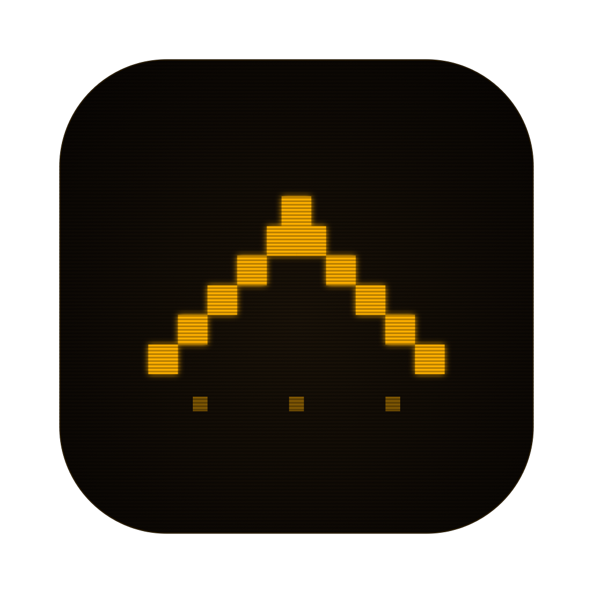
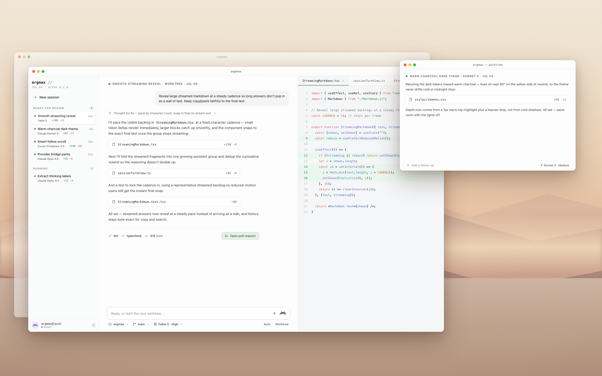

# Argmax

[](https://github.com/adamthuvesen/argmax/actions/workflows/ci.yml)  

<p align="center">
  
</p>

A local desktop app with a Rust core and React UI for running Claude Code, Codex, and Cursor Agent in isolated git worktrees or your current checkout.

Single-user, on-device, no cloud, no auth. Built for sessions that need real repo context: persistent transcripts, review tools, checks, approvals, and optional worktree isolation for running agents in parallel.



## Status

Early and still changing (0.2.0). The first public Rust/Tauri release targets macOS. Linux and Windows are not release targets yet.

Behavior, the SQLite schema, and the UI can change between versions. There are no stability guarantees yet.

## Stack

| Layer | Tooling |
|---|---|
| Runtime | Tauri 2 + Rust |
| Renderer | React 19 + Vite + plain CSS |
| Persistence | SQLite via `rusqlite` with FTS5 sidecars |
| PTY | `portable-pty` |
| IPC | `#[tauri::command]` + `tauri-specta` bindings |
| Tests | Vitest + Testing Library + Cargo tests |
| Packaging | Tauri bundler (`dmg`, `app`, updater `latest.json`) |

## Prerequisites

- **Node.js** 20.19+ or 22.12+ and npm
- **Rust** 1.95+ ([install rustup](https://rustup.rs))
- **macOS**. The first public Rust/Tauri release is macOS-only; Linux and Windows are not release targets yet.

## Setup & Run

```bash
npm install
npm run tauri:dev
```

This starts the macOS Tauri app with the Rust backend.

## Static Demo

Run the renderer in a browser with no secrets and no local app data:

```bash
npx vite --host 127.0.0.1
```

Open `http://127.0.0.1:5173/`.

Outside Tauri there is no Rust backend. The renderer uses `src/renderer/demoSnapshot.ts` instead of live IPC. The fixture uses sample paths and sample session text only.

The screenshot above shows the macOS app running agent sessions across parallel git worktrees: the review queue, an active session's conversation with file changes and passing checks, and the diff review pane.

## Reproducible Check

The renderer entry chunk is checked against a 2 MiB budget:

```bash
npm run build:renderer
npm run check:bundle
```

`check:bundle` reads `dist/renderer/index.html`, finds the emitted entry script, and fails if that file is over budget.

## Common Commands

```bash
npm run tauri:dev       # Tauri dev app
npm run tauri:build     # production Tauri bundle
npm run build:renderer  # browser renderer build
npm run lint            # ESLint
npm run typecheck       # renderer/shared TypeScript
npm run test:unit       # Vitest unit/integration tests
npm run test:perf       # renderer perf budgets
npm run test:rust       # Cargo tests for src-tauri
npm test                # unit + perf + Rust tests
npm run check:bindings  # generated bindings freshness guard
npm run check:tauri-bridge
```

## Layout

```
src/
├── renderer/     React UI built by Vite
├── shared/       Shared TS types and generated Rust bindings
└── test/         Vitest setup and renderer fixtures

src-tauri/        Rust runtime, services, persistence, IPC, packaging config
docs/             Subsystem docs
scripts/          Lightweight CI/check scripts
assets/           App icons
```

Build output (`dist/`, `release/`, `src-tauri/target/`) and local databases (`*.sqlite*`) are gitignored.

Runtime state lives in the Tauri app-data directory: `argmax.sqlite` plus checkpoint patches under `checkpoints/`. `raw_outputs` rows older than 7 days are pruned daily; everything else is kept.

Subsystem conventions live in [`AGENTS.md`](AGENTS.md) / [`CLAUDE.md`](CLAUDE.md).
