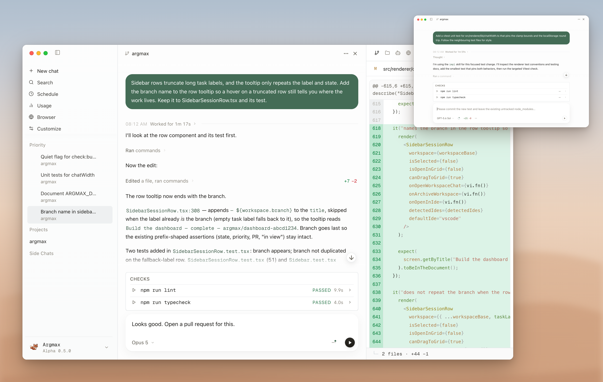

# Argmax

 

<p align="center">
  <picture>
    <source media="(prefers-color-scheme: dark)" srcset="assets/icon-dark.png">
    
  </picture>
</p>

A local desktop app for running Claude Code, Codex, Cursor Agent, and OpenCode in isolated git worktrees or your current checkout.

Single-user, on-device, no cloud, no auth. Includes persistent transcripts, diff review, checks, approvals, and worktree isolation for parallel agent runs.



## Status

macOS is the primary release target. See [CHANGELOG.md](CHANGELOG.md) for release history.

## Stack

| Layer | Tooling |
|---|---|
| Runtime | Tauri 2 + Rust |
| Renderer | React 19 + Vite + plain CSS |
| Persistence | SQLite via `rusqlite` with FTS5 sidecars |
| PTY | `portable-pty` |
| IPC | `#[tauri::command]` + `tauri-specta` bindings |
| Tests | Vitest + Testing Library + Cargo tests |
| Packaging | Tauri bundler (`dmg`, `app`, updater `latest.json`) |

## Prerequisites

- Node.js 20.19+ or 22.12+ and npm
- Rust 1.95+
- macOS

## Setup & Run

```bash
npm install
npm run tauri:dev
```

### Static UI Demo

Run the renderer in a browser using mock data from `src/renderer/demoSnapshot.ts`:

```bash
npx vite --host 127.0.0.1
```

## Commands

```bash
npm run tauri:dev       # Start Tauri dev app
npm run tauri:build     # Build production bundle
npm run build:renderer  # Build renderer bundle
npm run lint            # ESLint
npm run typecheck       # TypeScript check
npm run test:unit       # Vitest unit tests
npm run test:perf       # Performance benchmarks
npm run test:rust       # Cargo test suite
npm test                # Run all test suites
npm run check:bindings  # Verify TS bindings freshness
npm run check:tauri-bridge # Check IPC channel parity
npm run check:bundle    # Verify bundle size budget
```

## Layout

```
src/
├── renderer/     React UI
├── shared/       Shared TypeScript types and generated bindings
└── test/         Vitest configuration and test harness

src-tauri/        Rust runtime, services, persistence, IPC handlers
docs/             Subsystem documentation
scripts/          CI and verification scripts
assets/           Application icons
```

Runtime database state is stored in `argmax.sqlite` under the Tauri app data folder.

Subsystem details live in [`docs/`](docs/) and [`AGENTS.md`](AGENTS.md).
