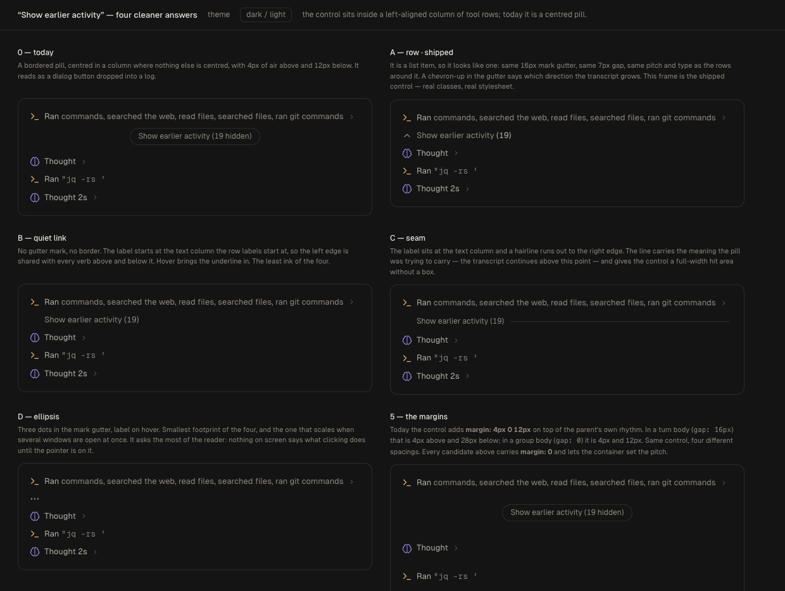
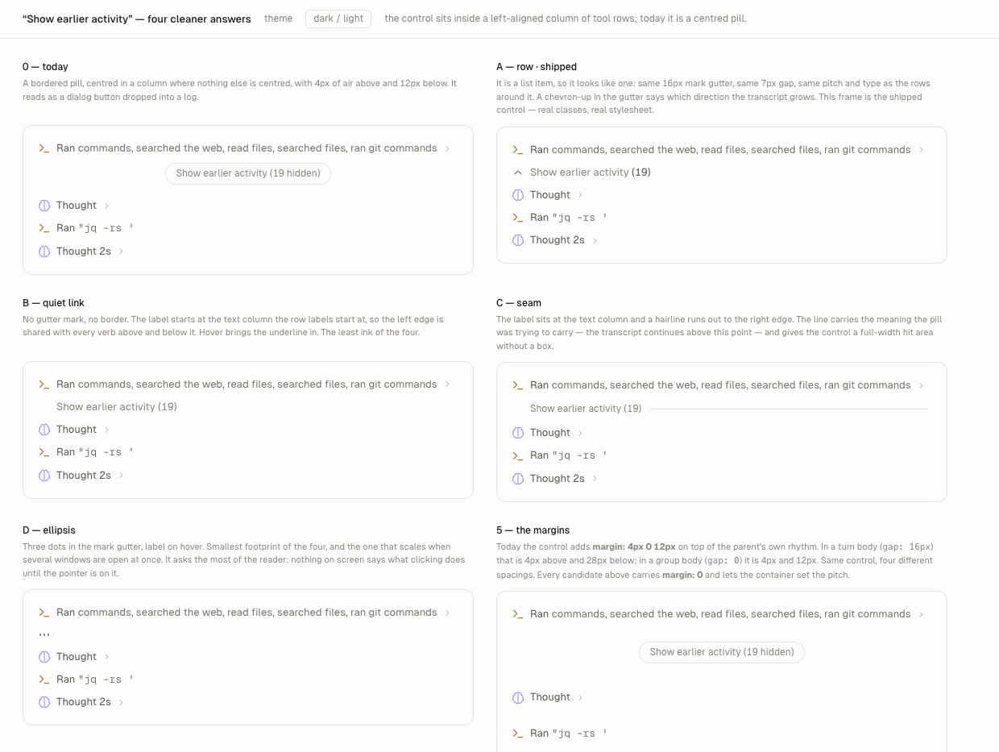

# "Show earlier activity" — mockups

The control that reveals the unmounted head of a long transcript
(`.conversation-show-earlier`, used by `TurnBlock` and `ToolCallGroupBubble`)
is a bordered pill centred in a column where nothing else is centred, and it
carries its own asymmetric margins on top of whatever rhythm its container
already sets. This page puts four replacements next to it in the real
transcript register so the choice is made by looking.

```bash
npx vite --port 5242 --strictPort            # from the repo root
open http://localhost:5242/docs/design/show-earlier/index.html
```

It loads the real `tokens.css`, `chat-turns.css`, `chat-conversation.css`,
`motion.css` and the bundled Geist faces. The surrounding rows are built from
the app's own measurements (16px mark gutter, 7px gap, `5px 4px 5px 0` pitch,
`--text-sm`), so each candidate is judged against the rows it would sit among.
Candidates use private `.se-*` classes so the cascade cannot bleed either way.

Query parameters: `?theme=light`, `?only=a|b|c|d|now|rhythm`.

## What is wrong today

| | |
| --- | --- |
| Alignment | `align-self: center` in a `flex-direction: column` body. Every sibling — group headlines, tool rows, thoughts — starts at the left edge. The pill is the only centred thing in the transcript. |
| Register | A 1px border and a 999px radius make it a dialog button. Nothing else in a turn body is a bordered control; the surface is built from bare rows. |
| Spacing | `margin: var(--space-1) 0 var(--space-3)` adds to the container's own rhythm. In `.turn-block-body` (`gap: var(--space-4)`) that is 20px above and 28px below; in `.tool-call-group-body` (`gap: 0`) it is 4px and 12px. One control, four different spacings. |

## Candidates

| | Idea | Cost |
| --- | --- | --- |
| **A — row** — *shipped* | Same mark gutter, gap, pitch and type as the rows around it; a chevron-up in the gutter for direction. It is a list item, so it looks like one. | Nothing new on the surface. Reads as another piece of activity, which is what it reveals. |
| **B — quiet link** | No mark, no border. The label starts at the text column, so it shares a left edge with every verb above and below. Underline on hover. | Least ink, but it floats: no gutter mark means the eye has nothing to catch. |
| **C — seam** | Label at the text column, hairline out to the right edge. The line carries the meaning the pill was reaching for — the transcript continues above this point — and gives a full-width hit area with no box. | One more hairline in a surface that keeps them rare. |
| **D — ellipsis** | Three dots in the mark gutter, label on hover. | Smallest footprint; asks the most of the reader, since nothing says what clicking does until the pointer is on it. |

All four carry `margin: 0` and let the container set the pitch.

**A shipped**, as `ShowEarlier` in `src/renderer/components/ShowEarlier.tsx`, used
by all four windows that can page a list: earlier messages
(`SessionConversation`), earlier activity in a turn (`TurnBlock`), earlier tool
calls and earlier child activity in a group (`ToolCallGroupBubble`). The count
also dropped the word "hidden" — `(19)` after "Show earlier activity" says it.
Frame A on this page renders the shipped classes against the real stylesheet,
so it stays honest as the rules change.




